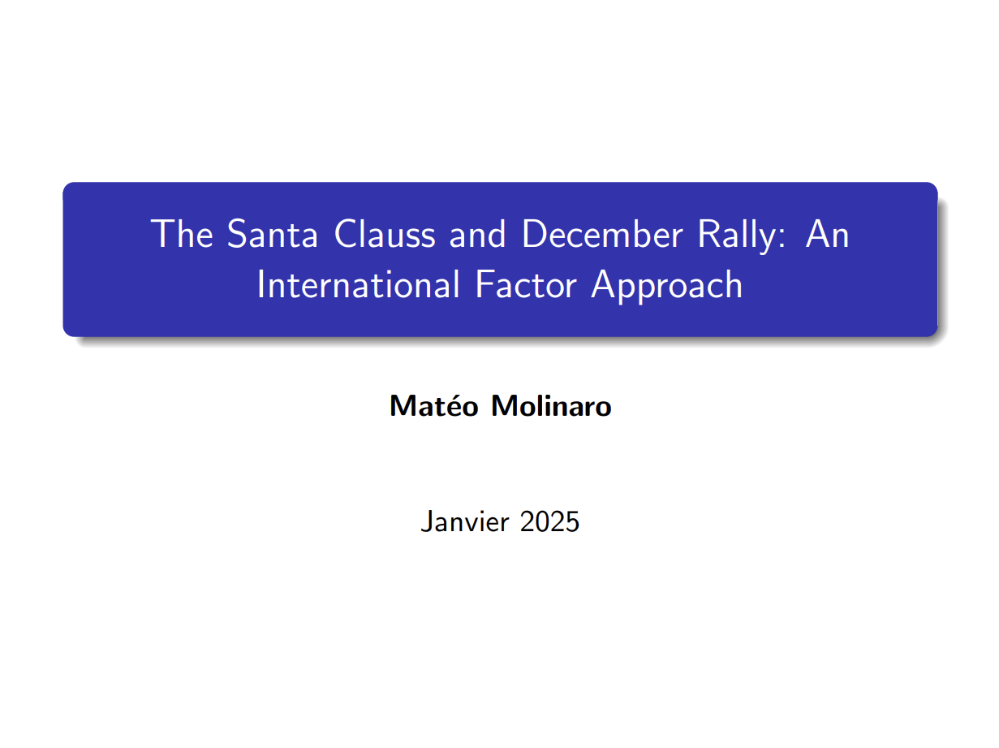
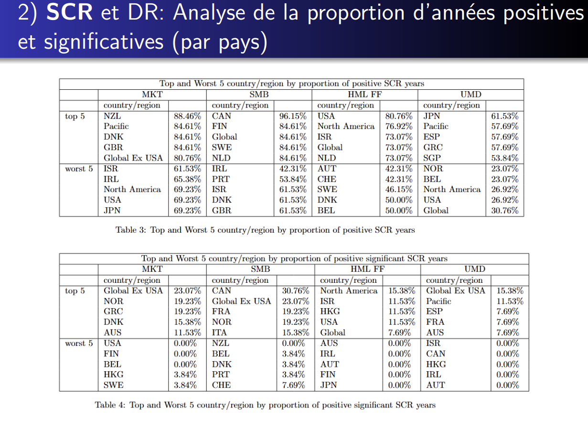

This project contains the code to reproduce the paper The Santa Claus Rally in U.S Stock Market Returns, JB Patel (2023). 

We do not only extend the paper, we also extend it. You can find our detailed results in the report in pdf or a shorter version in the pdf presentation.

I particularly focus on the extension in International Factor Data. You can find the results of my part in the pdf named Mateo Part.

Here's below a sample of my presentation on the Factor extension.

